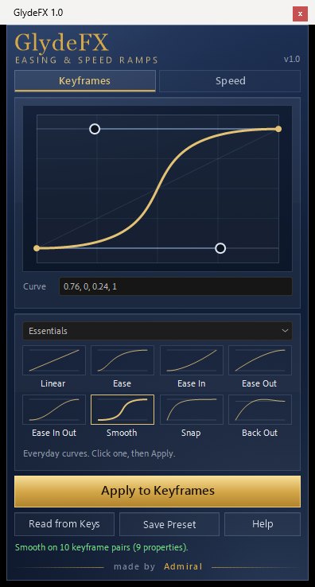
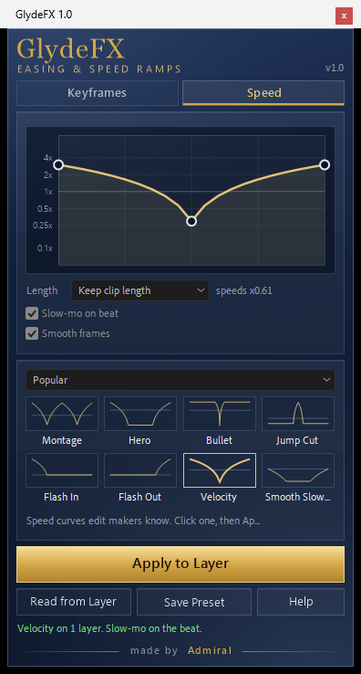

# GlydeFX

**Easing curves and speed ramps for Adobe After Effects.** One panel, two tabs: shape how
keyframes move, or shape how fast a clip plays. Free and open source: no account, no
license key, no network.

| Keyframes | Speed |
|---|---|
|  |  |

## Keyframes: easing curves

1. Select two or more keyframes next to each other in the timeline - any layers, any
   properties.
2. Pick a curve: click a preset, or drag the two handles in the editor.
3. Click **Apply to Keyframes**.

Presets, eight to a category:

| Category | Presets |
|---|---|
| **Essentials** | Linear, Ease, Ease In, Ease Out, Ease In Out, Smooth, Snap, Back Out |
| **Classic In / Out / In Out** | Sine, Quad, Cubic, Quart, Quint, Expo, Circ, Back (the easings.net curves) |
| **Edit** | Punch, Pop, Whip, Slam, Glide, Drop, Float, Snap Back |
| **My Presets** | eight places for your own curves |

The four numbers under the editor are the curve as `x1, y1, x2, y2`, the same as CSS
`cubic-bezier`: paste values from a website there and press Enter. **Read from Keys** loads
the curve of the selected keyframes into the editor; **Save Preset** keeps the editor's
curve in My Presets.

A handle above or below the square makes the motion overshoot or pull back first. Position,
mask and shape paths and colors cannot do that in After Effects - it stops them at their
keyframes - and the panel says so. For Position, right-click Position > Separate Dimensions
first; X Position and Y Position can overshoot.

## Speed: speed ramps

1. Select one or more video or precomp layers.
2. Pick a speed curve: click a preset, or drag the points in the editor (up is faster, down
   is slower; the bright line is normal speed). Double-click the curve to add a point,
   double-click a point to remove it.
3. Click **Apply to Layer**.

- **Length - Keep clip length**: the clip keeps its place and length in the timeline and
  shows the same part of the footage; its speeds are scaled to fit.
  **Keep all frames**: the speeds are used as drawn and the clip gets longer or shorter.
- **Slow-mo on beat** starts the slow motion on the nearest marker inside the clip - for
  example the beat markers [BeatDrop](https://github.com/ADMIRALisHERE/BeatDrop) adds.
- **Smooth frames** turns on Pixel Motion frame blending for smoother slow motion (renders
  take longer).
- **Read from Layer** loads a layer's speed curve back into the editor.

Presets: **Popular** - Montage, Hero, Bullet, Jump Cut, Flash In, Flash Out, Velocity,
Smooth Slow-mo; **Micro** - ramps for micro edits (very short clips cut fast in, slow in
the middle, fast out): Micro, Micro Snap, Micro Soft, Micro In, Micro Out, Micro Hold,
Micro Drop, Micro Rise; **Basic** - Speed Up, Slow Down, Ramp In, Ramp Out, Freeze Hit, 2x,
0.5x, Custom; **My Presets** - eight places for your own. Micro, Micro Snap and Micro Soft
are written as one smooth curve between two Time Remap keyframes.

Every Apply is one undo step, and every control explains itself in a tooltip.

## Install

1. Download `Admiral_GlydeFX.jsx` from the latest release.
2. In After Effects: **File > Scripts > Install ScriptUI Panel...** and choose the file,
   then restart After Effects.
   *Or* copy the file by hand into
   `Adobe After Effects <version>/Support Files/Scripts/ScriptUI Panels/`.
3. Open it from the **Window** menu: **Window > Admiral_GlydeFX.jsx**.

Requires After Effects 2022 or newer. Tested on Windows 11 with After Effects 2024 (24.6),
English interface. macOS and non-English After Effects have not been tested yet - feedback
is welcome.

To check a download, compare its SHA-256 with `SHA256SUMS.txt` in the release
(PowerShell: `Get-FileHash Admiral_GlydeFX.jsx`).

## How exact it is

Measured in After Effects 24.6 by sampling the animated values:

- An easing curve written to Opacity, Scale, Rotation, Position (straight and curved
  paths), a color, a mask path and a shape path follows the requested curve to within
  0.003 of the full move; reading it back gives the same curve.
- A speed curve becomes one Time Remap keyframe per point and matches the plan to within a
  thousandth of a frame.

## Known limits

- Position, paths and colors cannot overshoot (see above).
- The Edit and Speed presets are a first version: their shapes follow their names and may
  be tuned in later releases.
- Speed needs footage or a precomposition at 100 % stretch.

## Privacy

The panel keeps its settings and your presets in After Effects' own preferences. It writes
no other files (except, on an After Effects build that cannot read an image from a string,
its images into the system temp folder), launches no processes and uses no network.

## Building from source

The panel ships as one self-contained `.jsx`, built from `src/` with

```
py -3 build.py
```

which writes `dist/Admiral_GlydeFX.jsx` and `dist/SHA256SUMS.txt`. The artwork in
`src/assets` is drawn by `tools/gen_assets.ps1` and `tools/make_glass.py`. Changes are in
[CHANGELOG.md](CHANGELOG.md).

## License

Copyright (C) 2026 Amirhossein Asadi.

GlydeFX is free software under the [GNU General Public License v3.0 or later](LICENSE):
you may use it, share it and change it; if you share a changed version, you share its
source under the same license.

---

made by Admiral
